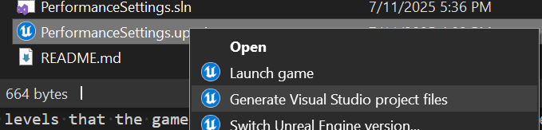
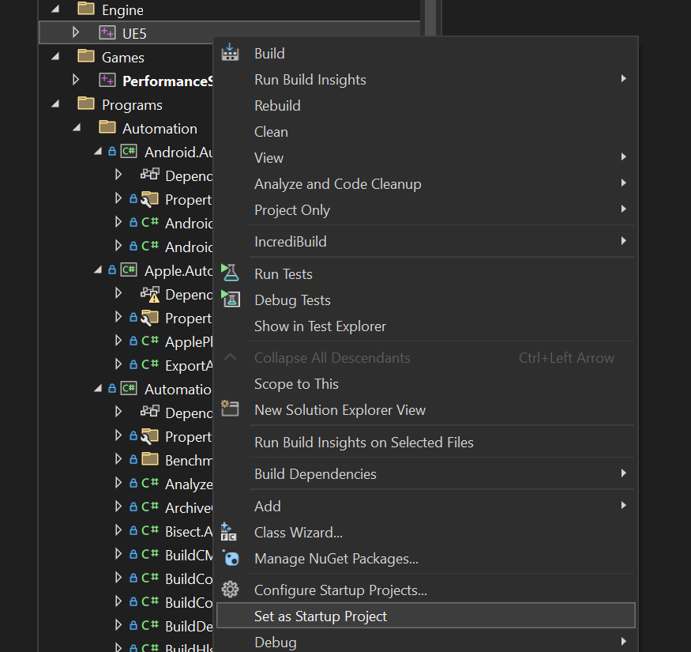
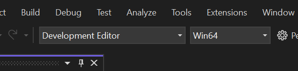

# Performance Settings for Unreal Engine

## Introduction

When developing for Oculus VR headsets, understanding and optimizing performance settings is crucial. High-performance VR experiences are essential for maintaining immersion and preventing motion sickness. By learning about various performance settings, you can ensure your VR applications run smoothly, providing users with a seamless and enjoyable experience. Proper performance tuning can also help you make the most of the hardware capabilities, leading to visually stunning and responsive VR environments. Whether you're aiming to enhance frame rates, reduce latency, or optimize resource usage, mastering these settings is a key step in delivering top-tier VR content.

## Setup



* Create the Visual Studio Projects:
  * In the project folder right click on PerformanceSettings.uproject
  * choose 'Generate Visual Studio Project Files
* Open the resulting 'PerformanceSettings.sln'



* set Unreal as the startup project



* Finally make sure you configure the project to run the UE Editor for the correct platform. e.g. Development Editor and Win64.

Build and run the project. You should see the Unreal editor launch, and from there you can launch the demo on your headset.


## Demo Overview

This demo showcases the impact of various performance settings on an Unreal Engine project designed for Oculus VR headsets. It includes comparisons of different configurations and their effects on frame rates, latency, and overall resource usage. By experimenting with these settings, developers can observe how changes influence the VR experience and identify the optimal configurations for their projects. The demo provides practical insights into performance tuning, helping developers achieve a balance between visual fidelity and smooth performance.

It has the following:

* Renderscale and Dynamic Resolution section: one of the most effective way to trade off between appearance and performance
  * Min/Max pixel density sliders: allows you to control the range of dynamic resolution
  * Render Scale: when dynamic resolution is disabled, this controls the render resolution.
* Performance Settings
  * Target framerate. This is the framerate that the game will try to maintain - higher is a potentially better experience, but leaves less time per-frame.
  * Fixed foveated rendering: a technique that reduces the number of pixels rendered where the player isn't looking, boosting performance
  * Mutisample antialiasing: reduces aliasing on the edges of objects by efficiently supersampling and averaging rendered fragments into each pixel at the cost of performance
  * CPU and GPU performance levels: these are the levels that the game will run at. The higher the level, the more power the game will use, but the higher the framerate.
  * Application SpaceWarp: renders at half the framerate and uses a technique to extrapolate the image to the next frame.
  * Passthrough: when enabled has additional composition cost.
* A CPU and GPU stress tester to see how settings impact performance
  * Num CPU Agents: how many thread to run
  * Percent of CPU: slider for how much of each core to taek
  * GPU Stress Tester: a slider that spawns things to render for load.

Note also that there are some settings that are not configurable at runtime and require stopping the game to change:

* Dynamic Resolution : must be changed in the project settings
* Dual-core mode: must be changed in the project settings (Meta Quest 2 only)
* Trading between CPU and GPU levels: must be changed in the project settings (Meta Quest 3 only)

## Renderscale and Dynamic Resolution

The resolution at which games and applications render involves a trade-off between appearance and performance:

* Higher resolution rendering reduces aliasing and makes games appear sharper, but it increases GPU usage.
* Lower resolution rendering decreases GPU usage, potentially allowing GPU-bound games and applications to maintain stable frame rates, but it makes games appear more jagged and blurrier.

Instead of offering a preset list of available resolutions (such as, “1920x1080”, “1280x720”), render resolution is controlled by the *render scale* parameter.

Dynamic Resolution is a feature that automatically adjusts the render scale. It increases the render scale when the GPU is underutilized and decreases it when the GPU is fully utilized. This feature is enabled by default and is currently recommended over manual adjustments. We highly recommend using this feature.

See

* [Render Scale](https://developers.meta.com/horizon/documentation/unreal/os-render-scale/)
* [Dynamic Resolution Docs](https://developers.meta.com/horizon/documentation/unreal/dynamic-resolution-unreal)

## Performance Settings

### [Fixed Foveated Rendering](https://developers.meta.com/horizon/documentation/unreal/unreal-ffr)

Foveated Rendering just means that you can render fewer pixels where the player isn't looking without them noticing, boosting performance. The 'fixed' aspect of it refers
to the fact that there's no eye tracking in some devices, so it just uses fewer pixels at the edge of the screen

For more information on Fixed Foveated Rendering:

* Please refer to the [official documentation](https://developers.meta.com/horizon/documentation/unreal/unreal-ffr).
* see also <https://developers.meta.com/horizon/documentation/unreal/os-fixed-foveated-rendering>

### Mutisampled Antialiasing

MSAA is a technique which reduces aliasing on the edges of objects by efficiently supersampling and averaging rendered fragments into each pixel. It creates a supersampled depth buffer. This buffer samples and records multiple screen-space positions corresponding to each individual output pixel. If a triangle covers all multisampled locations in an output pixel, its fragment shader only runs once, and there are no additional costs compared to rendering without any anti-aliasing. If different triangles cover different sampled locations in an output pixel, the fragment shader runs once per-triangle in the output pixel, and the results are blended.

See

* [Mobile GPUs and improved algorithms](https://developers.meta.com/horizon/documentation/unreal/gpu-improved-algorithms/)
* We did an [Analysis](https://developers.meta.com/horizon/documentation/native/android/mobile-msaa-analysis/) of MSAA so you can see the cost/benefits of using this.

### CPU and GPU Performance Levels

You have the ability to change the clock speed of the headset’s CPU and GPU while running your app. These controls allow you to decide whether to emphasize long battery life (through low clock speeds) or enhanced features (through high clock speeds) in your application.

To support simultaneous development on headsets with different chipsets we expose a system of CPU and GPU levels to select from, rather than giving you direct control over clock frequencies.

See

* [CPU and GPU Levels](https://developers.meta.com/horizon/documentation/unreal/os-cpu-gpu-levels)

### Application SpaceWarp

AppSW allows an app to render at half-rate (e.g., 36 FPS vs 72 FPS) by rendering a lower-resolution motion vector buffer and depth buffer that the system uses to synthesize new frames, which results in an output of 72 FPS to the display.

See

* [Application SpaceWarp](https://developers.meta.com/horizon/documentation/unreal/os-app-spacewarp)

### Passthrough

Passthrough provides a real-time view of the physical world within Meta Quest headsets. Passthrough is rendered by a dedicated service into a separate layer which can have performance implications.

See

* [Passthrough](https://developers.meta.com/horizon/documentation/unreal/unreal-passthrough-overview)

## Other CPU and GPU Options

### Trading between CPU and GPU levels (Meta Quest 3 Only)

In high-performance scenarios in which you’re likely to come up against the thermal governor needing to downclock your processors, your app has the ability to indicate whether it prefers to preserve CPU speed or GPU speed. This setting can be useful if you know your app is limited so much by either GPU or CPU performance that lowering one level to raise the other will result in an overall improvement in your app’s performance.
Once you’ve chosen to trade a level, this choice becomes part of the app manifest and it can’t be changed while the app is running.

```xml
        <meta-data
            android:name="com.oculus.trade_cpu_for_gpu_amount"
            android:value="1" />
```

### Dual-core mode (Meta Quest 2 Only)

Dual-core mode provides even higher clock speeds at the expense of only allowing the app to use two CPU cores instead of three. The thermal budget of the core that’s not being utilized can be added to the thermal allowance of the remaining cores, allowing apps in dual-core mode to the fastest clock speeds available on the headset.

```xml
        <meta-data
            android:name="com.oculus.dualcorecpuset"
            android:value="true" />
```

See

* [Dual CPU Mode](https://developers.meta.com/horizon/documentation/unreal/po-quest-boost#dual-core-mode) on Quest 2
* [Trading Between CPU and GPU](https://developers.meta.com/horizon/documentation/unreal/po-quest-boost#trading-between-cpu-and-gpu-levels-meta-quest-3-only)

# License
The [Meta License](./LICENSE) applies to the SDK and supporting material. The MIT License applies to only certain, clearly marked documents. If an individual file does not indicate which license it is subject to, then the Meta License applies.
